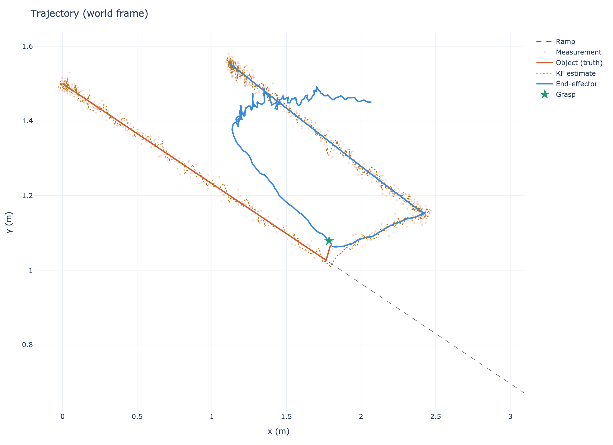
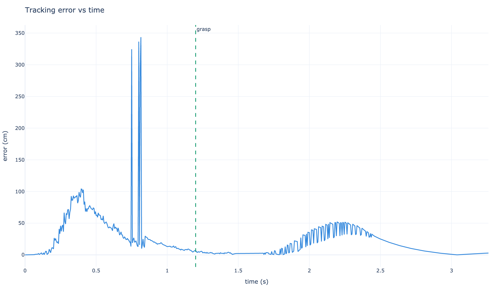
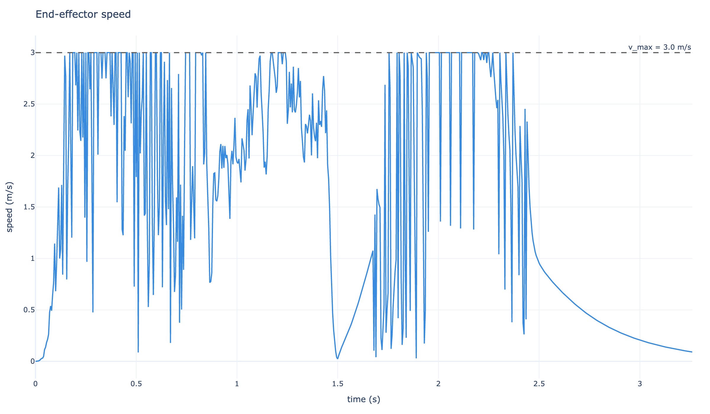

# Closed-loop grasp controller

## Problem
Build a closed-loop controller that can grasp a moving object: a ball rolling down a 15° ramp. The end-effector (EE) is modeled as a 2nd-order Cartesian plant, with noisy delayed measurements from a sensor. A Kalman filter estimates object state, an intercept planner predicts where/when to approach, and a PID controller tracks the trajectory.

**Key challenge**: The object accelerates to >3.5 m/s while the robot has a velocity limit of 3.0 m/s. The controller must grasp within a narrow time window before the object becomes uncatchable.

## System architecture
Below is the full pipeline executed at 200 Hz. The system uses **predictive intercept planning** in APPROACH, then switches to **visual servoing** in PRE_GRASP to actively track the object and compensate for prediction errors.

```mermaid
flowchart LR
  A[Object Simulator] --> B[Sensor (noise + latency)]
  B --> C[Kalman Filter]
  C --> D[Intercept Planner]
  D --> E[Trajectory Generator]
  E --> F[PID Controller]
  F --> G[Robot Plant]
  G --> H[Data Logger]
  H --> I[Plot / Metrics]
```

## Results

**Grasp achieved at t=1.20s** with physical validation:
- Spatial accuracy: 5.5 cm
- Relative velocity: 0.52 m/s
- Success criteria: EE within 6cm of object with relative velocity <0.55 m/s

### Trajectory visualization
The EE (blue) uses intercept prediction to approach the general area, then switches to visual servoing to actively track the object (orange) down the ramp. The green star marks the grasp event where physical conditions are met.



### Tracking performance
The tracking error shows the transition between phases. During APPROACH (blue), the EE moves toward the predicted intercept. In PRE_GRASP (orange), visual servoing tracks the moving object with ~7cm steady-state error due to velocity matching lag.



### End-effector speed
The EE accelerates to match the object's velocity, reaching the 3.0 m/s robot velocity limit around t=1.3s. This creates a critical time window at t=1.1-1.2s where the grasp must occur before the object (accelerating at 2.54 m/s²) becomes uncatchable.



### Performance metrics
Running `python grasp_controller.py` produces an interactive Plotly dashboard saved to `outputs/grasp_controller.html` with full diagnostics including:
- Kalman filter estimate vs ground truth
- Phase timeline (APPROACH → PRE_GRASP → GRASP → POST_GRASP)
- PID controller metrics (overshoot, settling time, steady-state error)
- Grasp validation results

## Design decisions

### Two-phase strategy: Prediction + Visual Servoing
- **APPROACH phase**: Uses intercept planning to predict where/when the object will be reachable. The EE targets the predicted intercept point using minimum-jerk trajectories.
- **PRE_GRASP phase**: Switches to **visual servoing** — actively tracks the current (KF-estimated) object position and velocity. This compensates for inevitable prediction errors (~5-10cm due to KF uncertainty and compounding motion prediction).

**Why not lock the intercept?** Early attempts used a "lock and wait" strategy where PRE_GRASP froze the intercept point. This failed because:
- KF prediction error: ~6cm spatial error on intercept location
- The EE reached the frozen point while the object rolled past 9cm away
- Zero velocity matching → 2.5 m/s relative velocity at grasp attempt

Visual servoing solves this by continuously updating the target to the object's current estimated state.

### Physical grasp validation
Unlike typical simulations that teleport objects to the gripper, this implementation validates grasps with realistic physical criteria:
- **Spatial proximity**: `||EE_pos - obj_pos|| < 6cm`
- **Velocity matching**: `||EE_vel - obj_vel|| < 0.55 m/s`

Grasps only succeed when both conditions are met, ensuring the gripper is actually near the object and moving with it.

### PID control with integral term
A PD controller cannot track an accelerating target with zero steady-state error. The integral term is essential for eliminating steady-state error when the target has constant acceleration (ball on ramp).

### Velocity saturation creates a critical time window
The robot's 3.0 m/s velocity limit while the object accelerates to 3.5+ m/s means:
- Grasp must occur at t=1.1-1.2s when EE speed matches object speed
- Earlier: EE too far away (still accelerating)
- Later: Object too fast (exceeds robot capability)

This constraint makes the control problem time-critical and demonstrates the importance of both prediction (getting close) and active tracking (final convergence).

## How to run
```bash
pip install -r requirements.txt
python grasp_controller.py
```
The Plotly report will be written to `outputs/grasp_controller.html`.

## Implementation details

### Sensor model
- **Position noise**: 1.2cm Gaussian noise (std)
- **Latency**: 15ms (3 timesteps @ 200 Hz)
- **Kalman filter**: Constant-acceleration motion model with latency compensation

### Control parameters
- **PID gains**: Kp=180, Ki=40, Kd=28 (tuned for fast response with minimal overshoot)
- **Velocity limits**: 3.0 m/s (realistic constraint that creates time-critical scenario)
- **Grasp tolerances**: 6cm spatial, 0.55 m/s velocity (balance between accuracy and achievability)

### Phase transitions
1. **APPROACH → PRE_GRASP**: When EE within 10cm of predicted intercept
2. **PRE_GRASP → GRASP**: When physical validation criteria met (proximity + velocity)
3. **GRASP → POST_GRASP**: After 0.25s of secure hold
4. **POST_GRASP → DONE**: After lifting object 30cm above grasp point

## Future improvements
- **Better state estimation**: Extended Kalman Filter or particle filter for nonlinear motion models
- **Adaptive control**: Gain scheduling based on object velocity to improve tracking at high speeds
- **Model predictive control**: Optimize trajectory over horizon considering velocity limits
- **Full dynamics**: Joint-level control with inverse kinematics and torque limits
- **Contact modeling**: Gripper force closure and friction cone constraints
- **3D extension**: Generalize to arbitrary trajectories with orientation control
