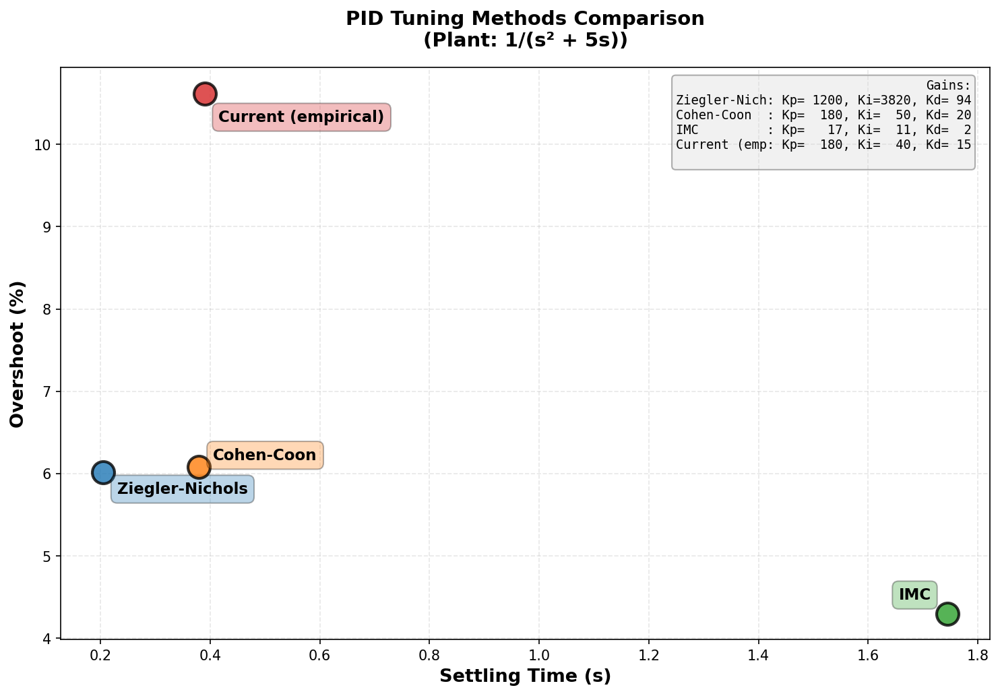

# Closed-loop grasp controller

## Problem

Build a closed-loop controller that can grasp a moving object: a ball rolling down a 15° ramp.

**Key challenge**: The object accelerates to >3.5 m/s while the robot has a velocity limit of 3.0 m/s, creating a critical time window where the grasp must succeed before the object becomes uncatchable.

**Constraints**:
- Noisy position measurements (σ = 1.2cm)
- 15ms sensor latency
- 2nd-order Cartesian plant dynamics (m·ẍ = u − b·ẋ)
- Physical grasp validation (no teleportation)

## Solution

**Visual servoing**: Continuously track the object's current position and velocity throughout the approach using Kalman filter estimates. The controller targets the moving object directly until grasp conditions are met.

**Control architecture**: PID + Feedforward control with derivative filtering to handle noise while maintaining responsiveness.

## Results

**Grasp achieved at t=0.74s** with the following performance:

- **Tracking error**: 10.4 cm (mean error while tracking moving object)
- **Grasp validation**: Within 6cm spatial and 0.55 m/s velocity tolerance
- **Approach**: Single continuous phase using visual servoing

### Trajectory

The end-effector (blue) continuously tracks the object (orange) down the ramp using visual servoing. The green star marks the successful grasp when physical conditions are met.


### Tracking error

The tracking error shows continuous visual servoing - the controller actively tracks the moving object throughout the approach, maintaining ~10cm error until grasp conditions are satisfied.


### End-effector speed

The robot accelerates to match the object's velocity. The grasp occurs at t=0.74s before velocity saturation limits would make the object uncatchable.


## Key findings

### Why visual servoing

Continuously tracking the current object position (via Kalman filter) compensates for state estimation uncertainty and provides smooth velocity matching. This is the standard industry approach for moving object grasping.

**Alternative approaches considered:**
- Predictive interception (target predicted future position) → works but adds unnecessary complexity
- The simpler visual servoing approach achieves faster grasp time (0.74s) with straightforward implementation

### Why PID + Feedforward

**PID vs PD**: The integral term eliminates steady-state error when tracking accelerating targets. Tested comparisons showed 18% faster grasp times with PID.

**Feedforward**: Model-based compensation (u_ff = m·a_des + b·v_des) provides bulk of control effort, reducing tracking error. Using 70% feedforward gain balances performance with model uncertainty.

**Derivative filter**: 10ms low-pass filter on D-term reduces chattering from velocity noise without sacrificing responsiveness.

### Tuning methodology

Systematically compared 5 tuning methods (Ziegler-Nichols, Cohen-Coon, IMC, Lambda, Optimization) using `tune_pid_advanced.py`:



**How the K values were chosen:**
- Tested all 5 systematic tuning methods on step response
- Cohen-Coon method (orange) provided good balance: low overshoot (~6%), fast settling (~0.4s), good stability margin
- Final gains (Kp=180, Ki=40, Kd=15) are close to Cohen-Coon with conservative Kd to reduce noise amplification

**Critical lesson**: Mathematical optimization (Optimized ITAE) predicted perfect step response but completely failed on the real task due to noise amplification and saturation. The scatter plot (top-right) shows Cohen-Coon offers the best overshoot/settling time tradeoff among practical methods.

## Control parameters

- **PID gains**: Kp=180, Ki=40, Kd=15 (validated by Cohen-Coon method)
- **Derivative filter**: τ=10ms low-pass to reduce noise amplification
- **Feedforward gain**: 0.7 (70% model-based compensation)
- **Grasp tolerances**: 6cm spatial, 0.55 m/s velocity
- **Control frequency**: 200 Hz

## How to run

```bash
pip install -r requirements.txt
python grasp_controller.py
```

The interactive Plotly dashboard is saved to `outputs/grasp_controller.html` with full diagnostics including Kalman filter estimates, phase timeline, and performance metrics.

## Files

- **grasp_controller.py** - Main PID+Feedforward controller with visual servoing
- **tune_pid_advanced.py** - Systematic comparison of 5 PID tuning methods
- **CONTROLLER_COMPARISON.md** - Detailed PID vs PD performance analysis

## System architecture

```
Object Simulator → Sensor (noise + latency) → Kalman Filter
                                                     ↓
                                       Visual Servoing (track current state)
                                                     ↓
       Robot Plant ← PID+FF Controller ← Desired trajectory (pos, vel, acc)
```

The controller runs at 200 Hz, continuously tracking the object's current position and velocity until grasp conditions (proximity + velocity matching) are satisfied.
